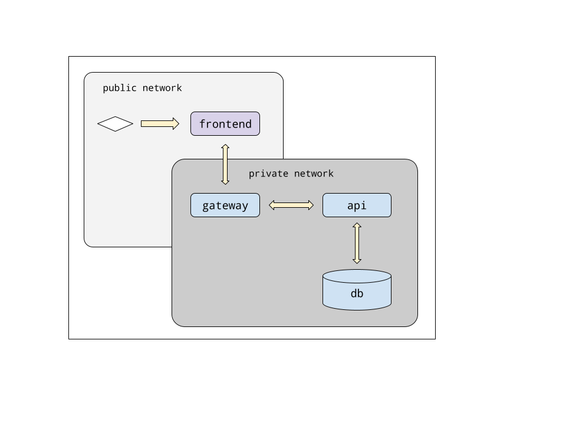

# Api-rest

Simple Spring Cloud based Microservice system for training purposes.

Technologies included:
 - Angular 14.* frontend application
 - Cypress e2e functional test
 - Spring Cloud Gateway
 - Spring Cloud Discovery Server
 - Spring Boot 2.7.1 backend REST API
 - Prometheus and Grafana monitoring
 - Docker & docker-compose container technology
 - Jmeter test plan

## Diagram



## Dependencies

 - Java openjdk version "17"
 - Node v16.16.3
    - @angular/cli
 - Docker & docker-compose

## Run the project

Execute this commands to run the application: 

```bash
$ cd ./api-rest
$ docker-compose up
```

Once started browse the app following this link:

URL:   http://localhost

Or execute e2e tests by running:

```bash
$ cd ./frontend
$ npx cypress run
```

## Components

### Frontend

Angular Application with a very simple interface to make CRUD requests.

### Backend

Spring-boot WEB CRUD Application.

BASE-URL:   http://localhost:8090/api/v1/hotels

|OPERATION|METHOD|URI|
|---|---|---|
|CREATE|GET|http://localhost:8090/api/v1/hotels|
|READ|GET|http://localhost:8090/api/v1/hotels/{id}|
|UPDATE|PUT|http://localhost:8090/api/v1/hotels|
|DELETE|DELETE|http://localhost:8090/api/v1/hotels/{id}|

API Documentation:

[http://localhost:8080/swagger-ui.html](http://localhost:8090/swagger-ui.html)
