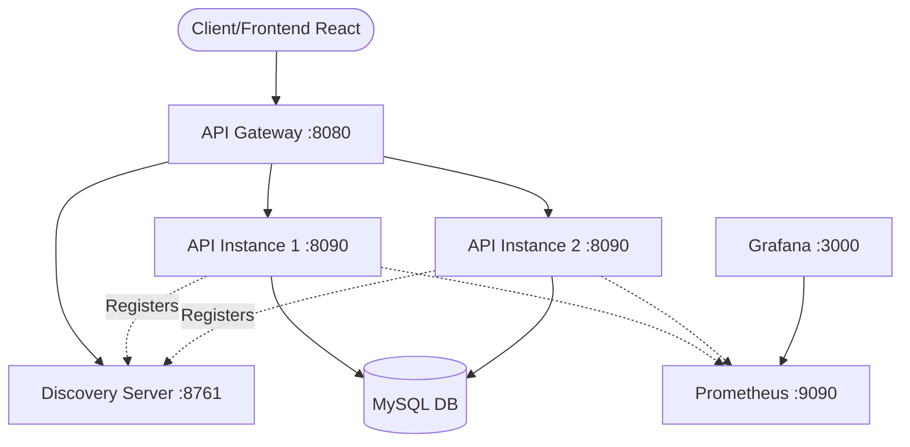
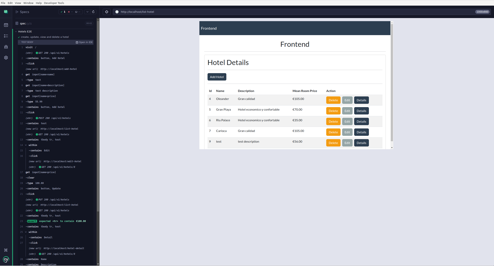
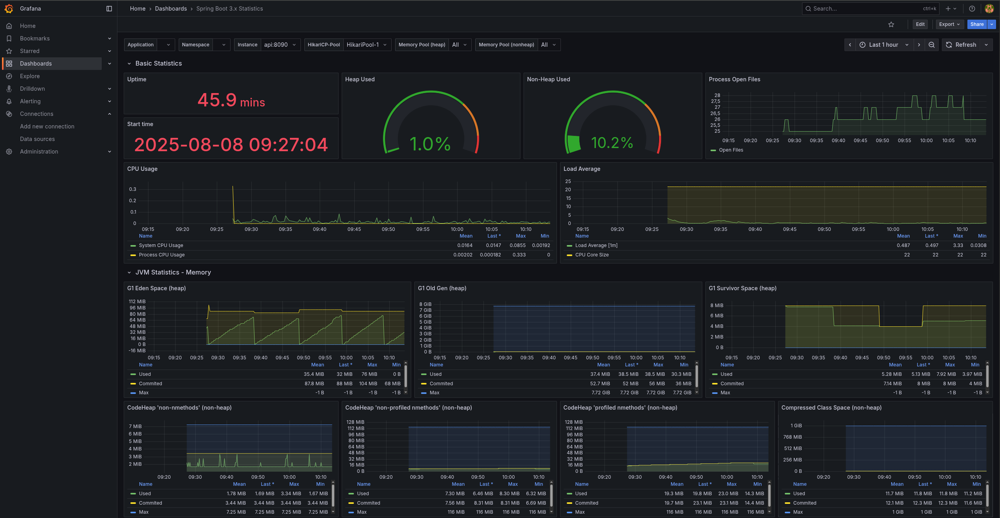

# Api-rest

Simple Spring Cloud based Microservice system for training purposes.

Technologies included:
 - **React 18** simple frontend application
 - **Cypress** e2e functional test
 - **Spring Cloud Gateway**
 - **Spring Cloud Discovery Server**
 - **Spring Boot 4.x** REST API
    - **Spring Modulith** for Modular Monolith architecture
    - **MapStruct** for high-performance object mapping
    - **DTO Pattern** for API/Domain separation
    - **Bean Validation** (JSR 303/380)
    - **RFC 7807** Problem Details for standardized error responses
    - **Liquibase** for DB migrations
    - **Testcontainers** for reliable integration testing
    - **Jmeter** test plan
 - **Grafana & Prometheus** for observability
 - **Docker & docker-compose** container technology

## Architecture Diagram


```mermaid
graph TD
    Client([Client/Frontend React]) --> Gateway[API Gateway :8080]
    Gateway --> Discovery[Discovery Server :8761]
    Gateway --> API1[API Instance 1 :8090]
    Gateway --> API2[API Instance 2 :8090]
    API1 -.-> |Registers| Discovery
    API2 -.-> |Registers| Discovery
    API1 --> DB[(MySQL DB)]
    API2 --> DB[(MySQL DB)]
    API1 -.-> Prometheus[Prometheus Metrics]
    API2 -.-> Prometheus
    Grafana[Grafana :3000] --> Prometheus[Prometheus :9090]
```

## Dependencies

 - Java openjdk version >=21
 - Maven >=3.9.11
 - Node >= 18.20.8
 - Docker & docker-compose

## Run the project

Execute this commands to run the application: 

```bash
$ cd ./api-rest
$ docker-compose up
```

Once started browse the app following this link:

URL:   http://localhost

Or execute e2e tests by running:

```bash
$ cd ./frontend
$ npx cypress open --e2e
```



## Components

### Frontend

React Application with a very simple interface to make CRUD requests.

Frontend: [http://localhost](http://localhost)

### Gateway

Spring Cloud Gateway as gatekeeper and load balancer.

BASE-URL:   http://localhost:8080

### Discovery-server

Spring Cloud Discovery Server

Dashboard: [http://localhost:8761](http://localhost:8761)

### Api

Spring-boot WEB CRUD Application using a modular architecture. The service is scaled to 2 replicas for load balancing.

BASE-URL: http://localhost:8080/api/v1/hotels (via Gateway)
Direct Instance Access: http://localhost:8090/api/v1/hotels (if exposed)

| OPERATION | METHOD | URI                  | SUCCESS STATUS                   |
|-----------|--------|----------------------|----------------------------------|
| LIST      | GET    | `/api/v1/hotels`     | 200 OK                           |
| CREATE    | POST   | `/api/v1/hotels`     | 201 Created                      |
| READ      | GET    | `/api/v1/hotels/{id}`| 200 OK                           |
| UPDATE    | PUT    | `/api/v1/hotels/{id}`| 200 OK                           |
| DELETE    | DELETE | `/api/v1/hotels/{id}`| 204 No Content                   |

API Documentation: [http://localhost:8080/swagger-ui.html](http://localhost:8080/swagger-ui.html)

### Prometheus

The Api project is configured to serve all the metrics at [http://localhost:8090/actuator/prometheus](http://localhost:8090/actuator/prometheus)

Access to Prometheus Dashboard: [http://localhost:9090](http://localhost:9090)

Prometheus configuration is located at:

```bash
$ ./prometheus
```

### Grafana

You can also use Grafana to visualize all the above commented prometheus metrics. A free dashboard is included in /grafana. You can download it [here](https://grafana.com/grafana/dashboards/19004-spring-boot-statistics/)

Access to Grafana Dashboard: [http://localhost:3000](http://localhost:3000):

1. Browse to home > connections > add new connection. Search prometheus and set http://prometheus:9090 as source URL.
2. go to dashboards > import > select 19004_rev1.json

And that's it:



### TODO

- Migrate observability to Open Telemetry
- Replace application.properties files with Spring Cloud Config Server
- Include login mecanism
 
