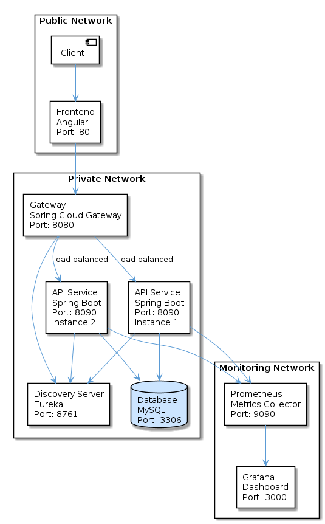

# Api-rest

Simple Spring Cloud based Microservice system for training purposes.

Technologies included:
 - Angular 18 simple frontend application
 - Cypress e2e functional test
 - Spring Cloud Gateway
 - Spring Cloud Discovery Server
 - Spring Boot 3.5.4 backend REST API
 - Prometheus and Grafana monitoring
 - Docker & docker-compose container technology
 - Jmeter test plan

## Diagram



## Dependencies

 - Java openjdk version >=21
 - Maven >=3.9.11
 - Node 18.20.8
 - Docker & docker-compose

## Run the project

Execute this commands to run the application: 

```bash
$ cd ./api-rest
$ docker-compose up
```

Once started browse the app following this link:

URL:   http://localhost

Or execute e2e tests by running:

```bash
$ cd ./frontend
$ npx cypress run
```

If you want to execute Cypress GUI run:

```bash
$ cd ./frontend
$ npx cypress open --e2e
```


## Components

### Frontend

Angular Application with a very simple interface to make CRUD requests.

Frontend: [http://localhost:80](http://localhost:80)

### Gateway

Spring Cloud Gateway as gatekeeper and load balancer.

BASE-URL:   http://localhost:8080

### Discovery-server

Spring Cloud Discovery Server

Dashboard: [http://localhost:8761](http://localhost:8761)

### Api

Spring-boot WEB CRUD Application.

BASE-URL:   http://localhost:8090/api/v1/hotels

|OPERATION|METHOD|URI|
|---|---|---|
|CREATE|GET|http://localhost:8090/api/v1/hotels|
|READ|GET|http://localhost:8090/api/v1/hotels/{id}|
|UPDATE|PUT|http://localhost:8090/api/v1/hotels|
|DELETE|DELETE|http://localhost:8090/api/v1/hotels/{id}|

API Documentation:

[http://localhost:8090/swagger-ui.html](http://localhost:8090/swagger-ui.html)

### Prometheus

The Api project is configured to serve all the metrics at [http://localhost:8090/actuator/prometheus](http://localhost:8090/actuator/prometheus)

Access to Prometheus Dashboard: [http://localhost:9090](http://localhost:9090)

Prometheus configuration is located at:

```bash
$ ./prometheus
```

### Grafana

You can also use Grafana to visualize all the above commented prometheus metrics. A free dashboard is included in /grafana. You can download it [here](https://grafana.com/grafana/dashboards/19004-spring-boot-statistics/)

Access to Grafana Dashboard: [http://localhost:3000](http://localhost:3000):

1. Browse to home > connections > add new connection. Search prometheus and set http://prometheus:9090 as source URL.
2. go to dashboards > import > select 19004_rev1.json

And that's it:


